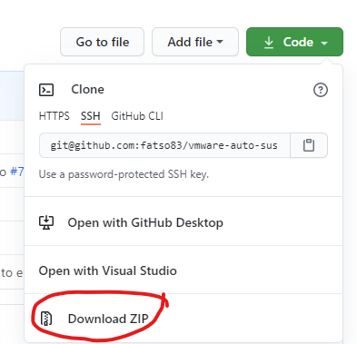
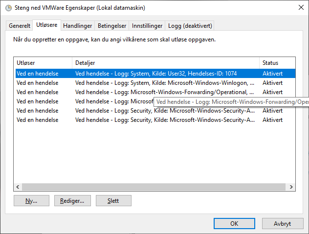

SuspendRunningVMs.bat
--------------------------------------
Contains the solution to this question:
> How do I set up VMWare Workstation (running on a Windows host) to 
> automatically suspend all guest VM's when the host OS shuts down or restarts?

This repo essentially contains a solution to the annoying
issue of losing your virtual machine state if Windows decides to log off 
and/or reboot. It does this by running the script when it detects certain
events associated with a logout.

While this feature does exist in VMWare, you have to convert your VM into
a Shared VM, which involves losing a lot of features. This doesn't have 
that drawback. The original solution was published by [@drueter](https://github.com/DavidRueter) on the 
[VMWare Community forum][vmware].

## Installing

1. Download the repo as a zip and unzip it 
1. Right click [`install.bat`][install] and _Run as Administrator_ 

That's it.

You should have something similar to the picture below if you examine the create
task in the task list. See the [old manual install for details][old-manual], if you are interested.

## Background
After a long and bumpy road through both [StackExchange][superuser] and the 
[VMWare Community Forums](https://communities.vmware.com/thread/618322) I 
finally was given a hint to [a useful thread][vmware] that contained
_exactly_ what I was interested in. 

But as that was kind of hidden and in a form that is hard to contribute to
if you find bugs in the solution, I decided to improve on this situation
by dumping the solution on GitHub. That fixes troublesome copy-paste
issues.

## Encounter any errors?
Most errors ([5](https://github.com/fatso83/vmware-auto-suspend/issues/5),
[7](https://github.com/fatso83/vmware-auto-suspend/issues/7),
[8](https://github.com/fatso83/vmware-auto-suspend/issues/8),
[9](https://github.com/fatso83/vmware-auto-suspend/issues/9)) are caused by
not following the instructions, resulting in encoding issues when copy-pasting 
the contents of the xml file manually. That is why I advocate 
downloading the zip file to avoid this issue. See the above
issues for a simple fix using Notepad.

[vmware]: https://communities.vmware.com/thread/570079 "VMWare Community Post with original solution"
[superuser]: https://superuser.com/questions/1482205/auto-snapshot-or-suspend-on-host-power-off-or-log-off "My StackExchange question"
[script]: https://raw.githubusercontent.com/fatso83/vmware-auto-suspend/master/SuspendRunningVMs.bat
[install]: https://raw.githubusercontent.com/fatso83/vmware-auto-suspend/master/install.bat
[xml]: https://raw.githubusercontent.com/fatso83/vmware-auto-suspend/master/vmware-auto-suspend.xml
[old-manual]: https://github.com/fatso83/vmware-auto-suspend/blob/e56fa94f08c5955c549a99649fd567c33d050ab3/MANUAL_INSTALL.md
